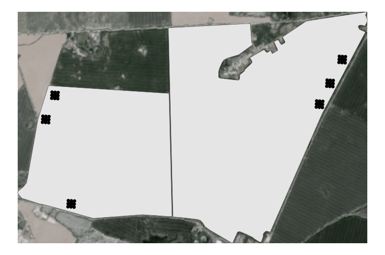
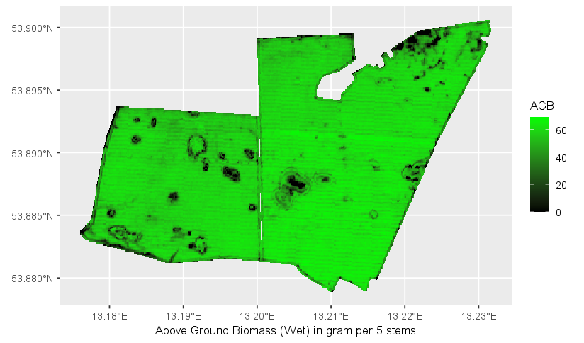
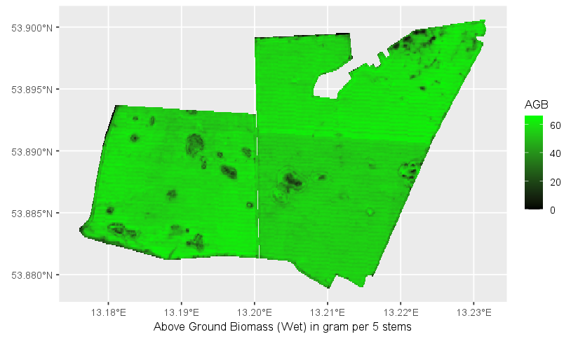
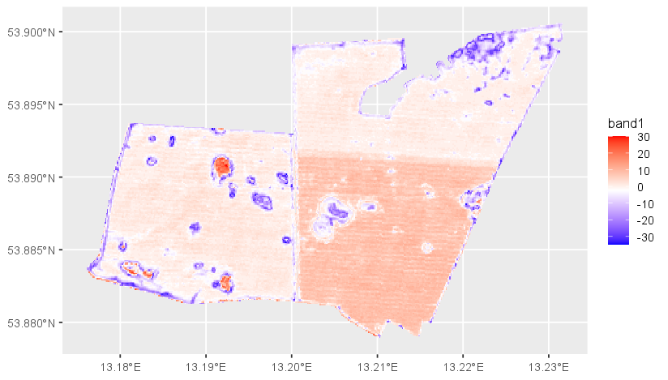

# Demmin Fieldwork

Welcome to the Demmin project. This fieldwork took place from 29th May to 3rd July in 2023 in two fields near the small 
village of Schmarsow located in north-eastern part of Western-Pomerania, Germany.  In this time, the fields were covered
with Winterwheat, planted in the autumn (usually September / October) of the previous year that will be harvested around
Juna or July. With this, the winter wheat we looked at, was already in a pretty advanced stage of growing. \
In those two fields, in total 78 GPS points were marked for measuring the stage of growing, height, density and seeding
angle of the plants as well as to collect samples and measuring the Above Ground Biomass (AGB).

### Course project definition
This Git is dedicated to build up a linear model to estimate AGB of winter wheat in Western-Pomerania using additional
Sentinel-2 data, as for Landsat, there is no imagery of high enough quality for the period of the fieldwork.

### Study Area
To gain a better understanding of the location and the fields we are in, we present a field map as follows:\
\

\
The map shows the location of the fields (pink) in the bottom right corner in Western-Pomerania (yellow outline) as well
as the fields themselves in the more detailed part of the map. Every field contains three *ESU*s, an agglomeration of 13
individual *SSU* points where measuring will be done. The points of each ESU are arranged in a way that they match the
pixel size of Landsat (30x30m) and Sentinel (10x10m) respectively. However, since as previously mentioned Landsat data
is unavailable, we use all pixels for Sentinel data.

### Measurements
For the ground truth selection of the AGB, at each point, samples were harvested and weighted back in a laboratory using a
scale. Furthermore, the samples were put into a dry oven for 24 hours to acquire their dry weight. Also weights of the 
bowl used for weighing were taken which will be subtracted from the weights afterward, receiving the pure AGB and Dryed
Biomass. For each point we sampled, the unique identifier consist of the **field name**, the **ESU** and the **SSU**
together.
\
### Sentinel-2 Data
The Sentinel-2 scene was acquired on the 3rd June 2023 being the most cloudless scene available for the period of the
fieldwork. The scene(s) (Landsat excluded in this analysis) were harvested via the Google Earth Engine (GEE) script
[here](https://code.earthengine.google.com/ea8954cb78b05868eca1926ac2fd3bdc?noload=true).

### Script and Workflow
We start of by loading the data acquired by GEE and the fieldwork itself, and plot a map with shortly the fields and
ESUS relevant for us. This way, we get a nice short overview of the dimensions we are dealing with, yielding also the
following plot:

```r
esus <- st_read("data/esus.gpkg")
fields <- st_read("data/fields.gpkg")

sentinel2 <- rast("data/sentinel2_fields.tif")
sentinel2_fields <- mask(sentinel2, fields)

gt <- read.csv("data/demmin_gt.csv")

ggplot() +
  layer_spatial(sentinel2) +
  geom_sf(data = fields) +
  geom_sf(data = esus)
```


In the next step we process the sentinel input for the sentinel file for the SSU inputs as they state the input values
for our linear regression model later on. Firstly, to get a unique identifier for every SSU we combine the 
**field name**, the **ESU**, and the **SSU** id with the `paste0()` command of R base. Secondly, we make sure the
weight arguments are numeric, not factorial for the regression. Finally, we conduct a `data.frame` named `reg_df` with 
the extracted sentinel values for these locations and combine it with our ground truth weight values from the `gt` csv
file with the `merge` function, by using our freshly created unique identifier. After subtracting the weight of the bowl
used for the weighing, we calculate the ***NDVI*** and ***EVI*** indices, used most for predicting AGB. Lastly, we
shuffle `reg_df`. The described code reads as follows:

```r
gt$short <- paste0(gt$field, gt$esu, gt$ssu)
gt$weight_wet <- as.numeric(gt$weight_wet)
gt$weight_bowl <- as.numeric(gt$weight_bowl)

ssus <- cbind(esus, extract(sentinel2_fields, esus))

reg_df <- as.data.frame(ssus)
reg_df <- merge(reg_df, gt, by = "short", all = FALSE)

reg_df$weight_wet <- reg_df$weight_wet - reg_df$weight_bowl

reg_df$evi <- (2.5 * (reg_df$B8 - reg_df$B4)) / (reg_df$B8 + (2.4 * reg_df$B4) + 10000)
reg_df$ndvi <- ((reg_df$B8 - reg_df$B4) / (reg_df$B8 + reg_df$B4))

reg_df <- reg_df[sample(1:nrow(reg_df)), ]
```

With this setup we are ready to fit a model. For our example, a simple linear model `lm()` worked best, while 
surprisingly Support Vector Machines (SVMs) oder Random Forests (RFs) failed. In the subsequent code snippet we split
our data into training and testing data with a commonly used ratio on 80/20. After selecting only important columns to
minimize access times of the program, we fit a linear model using the base R `lm()` function, validating it directly
after. Lastly, we calculate the Mean Absolute Error (MAE) of both the NDVI and EVI variables as predictors. However,
since we have not much data, they vary alot over which samples we used for training and which for testing as this might
change with multiple runs, since we shuffle `reg_df`:

```r
trainIndex <- nrow(reg_df) * 0.8
train_df <- reg_df[0:trainIndex,]
valid_df <- reg_df[(trainIndex):nrow(reg_df) + 1,]

train_df <- train_df[,c("short", "ndvi", "evi", "weight_wet")]
valid_df <- valid_df[,c("short", "ndvi", "evi", "weight_wet")]

fit_ndvi <- lm(formula = weight_wet ~ ndvi, data = train_df)
fit_evi <- lm(formula = weight_wet ~ evi, data = train_df)

preds_ndvi <- predict(fit_ndvi, valid_df)
preds_evi <- predict(fit_evi, valid_df)

mean_ndvi <- mean(valid_df$weight_wet - preds_ndvi)
mean_evi <- mean(valid_df$weight_wet - preds_evi)
```

Nonetheless, we want to visualize the MAE a bit more. For this purpose, we compose a data frame `long_df` where we store
the values of the AGB prediction of NDVI and EVI respectively, as well as the true AGB from our validation data frame.
Below the code, we present a ggplot featuring the true AGB (<span style="color:#017825">▮</span>), EVIs prediction 
(<span style="color:#0073C2">▮</span>), and NDVIs prediction (<span style="color:salmon">▮</span>).

```r
preds_ndvi <- as.numeric(preds_ndvi)
preds_evi <- as.numeric(preds_evi)
preds_df <- data.frame(x = seq_along(preds_ndvi), y_ndvi = preds_ndvi, weight_wet = valid_df$weight_wet, y_evi = preds_evi)

df_long <- tidyr::pivot_longer(preds_df, cols = c(y_ndvi, weight_wet, y_evi))
df_long$name <- factor(df_long$name, levels = c("y_ndvi", "weight_wet", "y_evi"))

ggplot(df_long, aes(x = as.factor(x), y = value, fill = name)) +
  geom_bar(stat = "identity", position = "dodge", width = 0.7) +
  xlab("SSUS") +
  ylab("AGB in g / 5 stems") +
  scale_fill_manual(
    values = c("#886CE4", "#16C60C", "#8E562E"),
    labels = c("Est. NDVI", "True AGB", "Est. EVI"),
    guide_colorbar(title = "")
  ) +
  scale_x_discrete(breaks = seq_along(valid_df$short), labels = valid_df$short) +
  coord_flip()
```

We now want to predict with our model the whole to field **F1** and **F2**. To do so, we extract all pixels from the
sentinel file (which was cropped earlier to the field shapes) and calculate ***NDVI*** and ***EVI*** indices for it.
With these, predicting the AGB following the same scheme as we used at the validation dataframe.

```r
sen2pixels <- extract(sentinel2_fields, seq_along(0:length(values(sentinel2_fields))))
sen2pixels$evi <- (2.5 * (sen2pixels$B8 - sen2pixels$B4)) / (sen2pixels$B8 + (2.4 * sen2pixels$B4) + 10000)
sen2pixels$ndvi <- ((sen2pixels$B8 - sen2pixels$B4) / (sen2pixels$B8 + sen2pixels$B4))
```

<table>
<tr>
<th>NDVI</th>
<th>EVI</th>
</tr>
<tr>
<td>

```r
preds_fields_ndvi <- predict(fit_ndvi, sen2pixels)

sentinel2_pred_ndvi <- sentinel2_fields[[1]]
sentinel2_pred_ndvi[!is.na(sentinel2_pred_ndvi)] <- as.numeric(preds_fields_ndvi)[!is.na(preds_fields_ndvi)]
sentinel2_pred_ndvi[sentinel2_pred_ndvi < 0] <- 0

ggplot() +
  layer_spatial(data = sentinel2_pred_ndvi) +
  scale_fill_gradientn(
    colors = c("black", "green"),
    na.value = "transparent",
    guide_colorbar(title = "AGB"),
  ) +
  xlab("Above Ground Biomass (Wet) in gram per 5 stems")
```



</td>
<td>

```r
preds_fields_evi <- predict(fit_evi, sen2pixels)

sentinel2_pred_evi <- sentinel2_fields[[1]]
sentinel2_pred_evi[!is.na(sentinel2_pred_evi)] <- as.numeric(preds_fields_evi)[!is.na(preds_fields_evi)]
sentinel2_pred_evi[sentinel2_pred_evi < 0] <- 0

ggplot() +
  layer_spatial(data = sentinel2_pred_evi) +
  scale_fill_gradientn(
    colors = c("black", "green"),
    na.value = "transparent",
    guide_colorbar(title = "AGB"),
  ) +
  xlab("Above Ground Biomass (Wet) in gram per 5 stems")
```



</td>
</tr>
</table>

Lastly for this analysis, we can easily compute the difference between the two predictors used in their models, 
respectively. With this, we really visualize the characteristics on how the models handle different situations. We use
the snippet as follows. Red areas show where the ***NDVI*** yields more AGB than the ***EVI***, blue areas where less.

```r
diff <- sentinel2_pred_ndvi - sentinel2_pred_evi

ggplot() +
  layer_spatial(data = diff) +
  scale_fill_gradientn(colors = c("blue", "white", "red"), na.value = "transparent")
```




## Conclusion and Possible Usages


